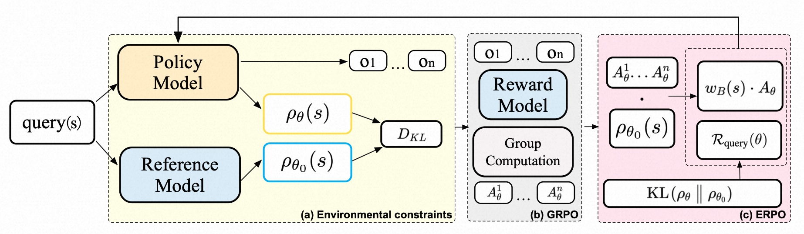
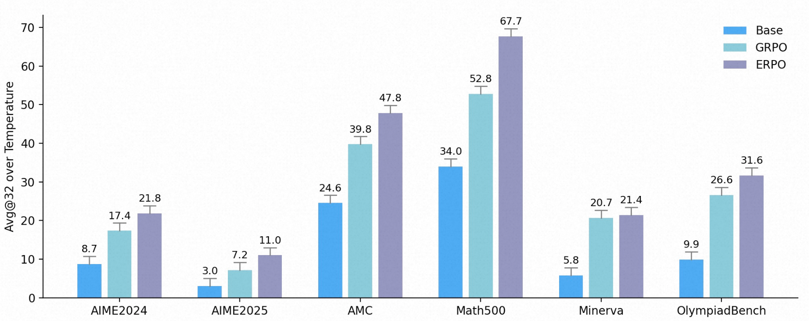
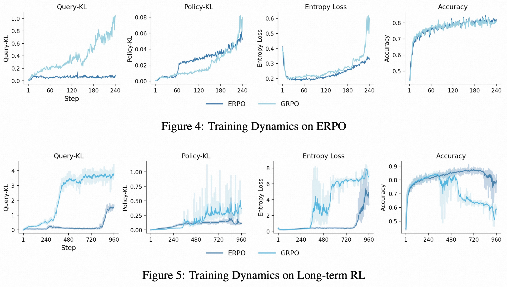

<div align='center'>
<h1>ERPO: Environment-Regularized Policy Optimization</h1>
<h4>Breaking the Stability–Exploration Dilemma by Moving Regularization from the Action Side to the Input Side</h4>

[](https://arxiv.org/abs/2608.23311)
[](./2608.23311v1.pdf)
[](https://github.com/AlibabaResearch/ERPO)
[](https://arxiv.org/abs/2608.23311)
</div>

> [!IMPORTANT]
> **🔥 News**
> - [2026/08] ERPO is accepted to **EMNLP 2026 main conference**.
> - [2026/08] We release the full training recipe, configuration files, and evaluation data on ROLL.

Policy optimization (PO) for LLMs faces a persistent **stability–exploration trade-off**: the standard Policy-KL regularizer acts on the *response* (action) distribution, constraining exploration while leaving the *query* (input) distribution completely unchecked. As training progresses, the model's own likelihood over training queries drifts away from its pre-RL reference, silently destabilizing the optimization.

**Environment-Regularized Policy Optimization (ERPO)** breaks this dilemma by moving regularization to the input side. It introduces two complementary components:

1. **Query-KL (QKL)**: a KL penalty on the *query* distribution induced by the current policy, bounding its drift from the pre-RL reference. The QKL gradient flows strictly through the query likelihood — the response score function is untouched, so exploration is fully preserved.
2. **Reference-derived per-query weight**: a dataset-static weight that biases each per-query update toward queries typical under the reference distribution, reducing estimator variance and improving robustness at high decoding temperatures.

Both components are estimator-agnostic and plug into GRPO/PPO/REINFORCE-style pipelines **without additional forward passes**.

<p align="center">
  
</p>

**ERPO overview.** (a) The policy and reference models induce current (`ρ_θ`) and reference (`ρ_θ₀`) query distributions; ERPO adds a Query-KL to bound their drift. (b) The standard GRPO pipeline scores sampled responses and computes group advantages. (c) ERPO replaces response-KL with the Query-KL term and reweights advantages by the reference-derived per-query weight, yielding an environment-aware update.

## Key Results

On six mathematical reasoning benchmarks (Qwen2.5-Math-7B, 240 training steps), ERPO consistently outperforms the GRPO baseline:

| Method | AIME24 | AIME25 | AMC | MATH500 | Minerva | Olympiad | **Avg.** |
| --- | --- | --- | --- | --- | --- | --- | --- |
| GRPO | 0.174 | 0.072 | 0.398 | 0.528 | 0.207 | 0.266 | 0.274 |
| **ERPO** | **0.218** | **0.110** | **0.478** | **0.677** | **0.214** | **0.316** | **0.336** |

*Mean Avg@32, averaged over sampling temperatures 0.1–1.5. ERPO achieves an overall average improvement of **6.2%** in Avg@32, 3.6% in Pass@32, and 5.7% in Pass@1. For full results including Pass@32, Pass@1, and long-horizon (1K-step) training dynamics, see the [paper](https://arxiv.org/abs/2608.23311).*

<p align="center">
  
</p>

### Training Dynamics

ERPO replaces the action-side Policy-KL with input-side regularization, and the effect is visible throughout training: the query distribution stays anchored to the reference while GRPO drifts, and long-horizon runs remain stable instead of collapsing.

<p align="center">
  
</p>

**Top (240 steps):** under GRPO the Query-KL rises unchecked even though Policy-KL stays flat, and entropy spikes late in training. ERPO keeps both the query distribution and entropy stable. **Bottom (960 steps):** in long-horizon RL, GRPO's Query-KL and Policy-KL explode after ~480 steps and accuracy collapses; ERPO remains stable and keeps high accuracy.

## Repository Structure

This repository contains the **ERPO incremental patch** on top of the [ROLL](https://github.com/alibaba/ROLL) RL framework. It is *not* a standalone training system — you must merge it with a full ROLL installation.

| Path | Content |
| --- | --- |
| `roll/pipeline/rlvr/actor_worker.py` | ERPO core: `prepare_backward_batch`, dynamic per-query weights, Query-KL |
| `roll/pipeline/rlvr/rlvr_config.py` | `dynamic_prompt_logp_loss_weight` configuration flag |
| `examples/erpo/` | ERPO / GRPO controlled-comparison YAML configs (2 files) |
| `data/erpo/` | Training & evaluation JSONL with `manifest.json` checksum manifest |
| `assets/` | Figures used in this README (overview, results, training dynamics) |

## Quick Start with ROLL

### 1. Integrate with ROLL

You need a [ROLL installation](https://github.com/alibaba/ROLL/) that includes the ERPO extension points (`dynamic_prompt_logp_loss_weight` field, `prepare_backward_batch` hook, `op_data_parallel_sum`). Choose one of:

**Option A: Merge into a full ROLL source tree (recommended)**

```bash
git clone <your-roll-repo-with-erpo>
cd ROLL
cp -r <path-to-erpo>/roll/* roll/
cp -r <path-to-erpo>/examples/erpo examples/
cp -r <path-to-erpo>/data/erpo data/
```

**Option B: Pip install then overwrite**

```bash
pip install roll  # with ERPO patch
python -c "import roll.pipeline.rlvr, os; print(os.path.dirname(roll.pipeline.rlvr.__file__))"
# Overwrite actor_worker.py and rlvr_config.py under the printed path
```

### 2. Data

The prepared training and evaluation data is ready to use in `data/erpo/`:

- Training data: `data/erpo/train/`
- Evaluation data: `data/erpo/eval/`
- Checksums and metadata: `data/erpo/manifest.json`

### 3. Launch Training

Run from the ROLL project root:

```bash
# ERPO
python examples/start_rlvr_pipeline.py \
  --config_path examples/erpo \
  --config_name erpo_base_qwen25_7b

# GRPO baseline (switches off per-query weight and uses response-KL)
python examples/start_rlvr_pipeline.py \
  --config_path examples/erpo \
  --config_name grpo_base_qwen25_7b
```

Cluster/AI Hub submission scripts (`submit_pipeline.sh` / `submit_pipeline_amd.sh`) are internal infrastructure and remain in the main ROLL repository under `examples/erpo/`.

Resume a failed run:

```bash
BASE_NAME=<new-job-name> \
OSS_RUN_BASE=oss://your-bucket/erpo/runs/<source-run> \
RESUME_FROM_CHECKPOINT=oss://your-bucket/erpo/runs/<source-run>/ckpt/checkpoint-<step> \
bash examples/erpo/submit_pipeline.sh
```

## ERPO vs GRPO: Configuration Switch

Controlled comparison: only two flags differ; model, data, seed, rollout shape (128×8), optimizer batch (1024 responses), sequence packing, and validation sets are identical.

| Flag | ERPO (`erpo_base_qwen25_7b.yaml`) | GRPO (`grpo_base_qwen25_7b.yaml`) |
| --- | --- | --- |
| `dynamic_prompt_logp_loss_weight` | `true` | `false` |
| `kl_loss_mask_mode` | `prompt` | `response` |
| `use_kl_loss` / `kl_loss_coef` | `true` / `1.0e-2` | same |

## Citation

```bibtex
@misc{zhou2026erpo,
      title={Beyond the Stability-Exploration Dilemma: Environmental Regularization for LLM Policy Optimization}, 
      author={Xianlei Zhou and Xiangdi Meng and Yu He and Tianyu Qi and Shuyan Guan and Xianli Zhang and Jian Zhang and Xin Li and Qika Lin and Jun Liu},
      year={2026},
      eprint={2608.23311},
      archivePrefix={arXiv},
      primaryClass={cs.CL},
      url={https://arxiv.org/abs/2608.23311}, 
}
```

## Acknowledgement

We thank the [ROLL](https://github.com/alibaba/ROLL) team for providing the efficient and scalable RL infrastructure that made this work possible.
